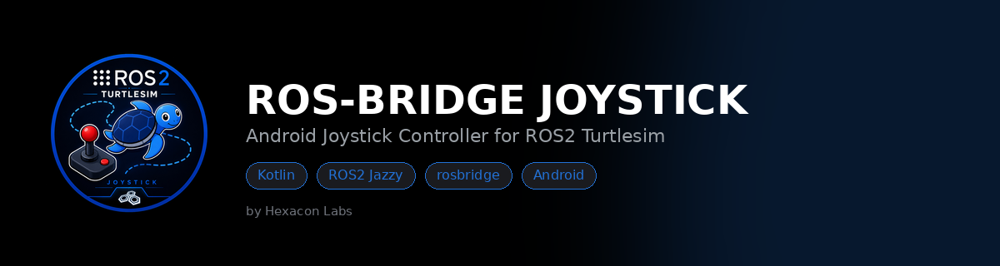
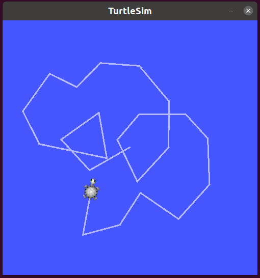
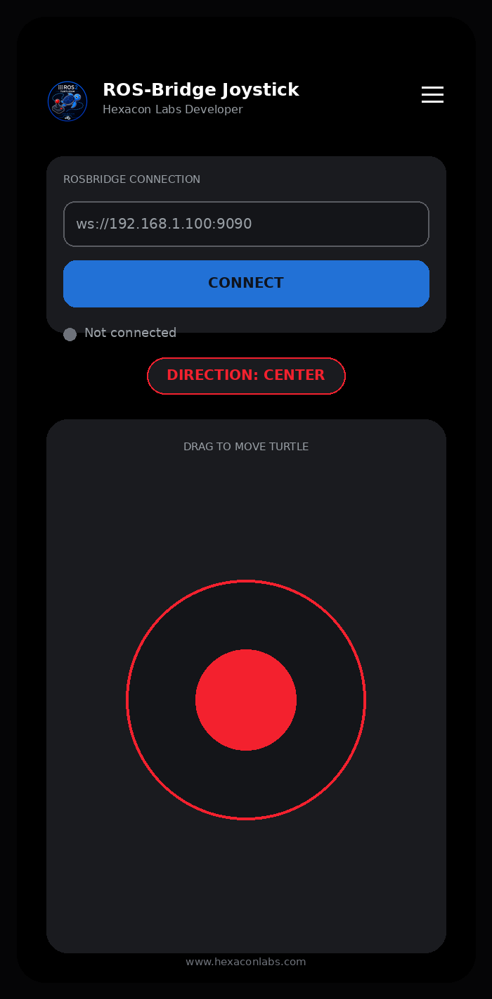
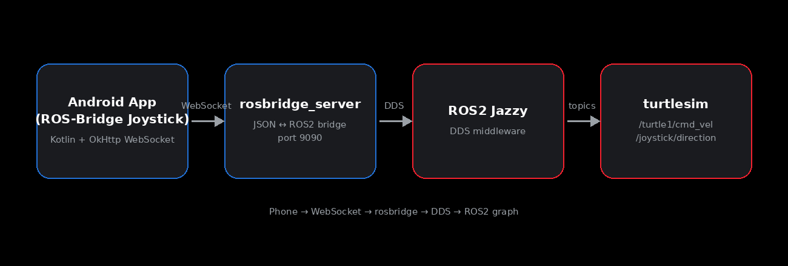

<div align="center">



# ROS Bridge TurtleSim Joystick

**A Kotlin Android joystick that drives a ROS2 `turtlesim` turtle over `rosbridge`.**

[](#)
[](#)
[](#)
[](#)

</div>

---

## Overview

**ROS Bridge TurtleSim Joystick** is a small Android app built as teaching material for bridging Android Application and ROS2. It shows two things at once:

- an on-screen analog joystick publishing `geometry_msgs/Twist` to
  `/turtle1/cmd_vel`, driving a `turtlesim` turtle in real time
- the *discrete* direction (`UP` / `DOWN` / `LEFT` / `RIGHT` / `CENTER`)
  published separately to `/joystick/direction`, so viewers can `ros2 topic
  echo` exactly which arrow is "pressed" at any moment

No native ROS2 SDK on the phone — just a WebSocket talking to
`rosbridge_server`, which is the standard, lightweight way to connect
phones/web apps to a ROS2 graph.

<p align="center">
  
  
</p>

## Features

| | |
|---|---|
| 🕹️ **Analog joystick** | Custom `View`, smooth drag, snaps back to center on release |
| 📡 **Live ROS2 bridge** | Publishes `Twist` to `/turtle1/cmd_vel` over `rosbridge`, throttled to ~20 Hz |
| 🧭 **Direction events** | Separate `std_msgs/String` topic (`/joystick/direction`) fires only on change |
| 🎨 **Modern dark UI** | Card-based layout, mint accent theme, live connection status dot |
| 🔧 **Fully tweakable** | Speed limits, dead-zone, publish rate, colors, and logo are all single-point edits |

## Architecture

<p align="center">
  
</p>

The app never talks ROS2 directly — it sends plain JSON over a WebSocket
using the [rosbridge v2 protocol](https://github.com/RobotWebTools/rosbridge_suite),
and `rosbridge_server` translates that onto the ROS2 graph.

## Project structure

```
ROS2_TurtleSim_Joystick/
├── app/src/main/java/com/hexaconlabs/rosjoystick/
│   ├── JoystickView.kt      # Custom touch-driven joystick, outputs normalized x/y
│   ├── RosBridgeClient.kt   # OkHttp WebSocket wrapper speaking rosbridge JSON
│   └── MainActivity.kt      # Wires joystick → Twist + direction publishing
│   └── SplashActivity.kt    # Splash Screen with Dynamic Loading Text
│
├── app/src/main/res/
│   ├── layout/activity_main.xml   # Card-based modern UI
│   ├── values/colors.xml          # Theme palette (edit this to restyle everything)
│   ├── values/themes.xml
│   └── drawable-*/logo.png        # App logo, one per density bucket
└── docs/images/                   # Assets used in this README
```

## Quick start

### 1. ROS2 side (Ubuntu + ROS2 Jazzy)

```bash
sudo apt update
sudo apt install ros-jazzy-turtlesim ros-jazzy-rosbridge-suite
source /opt/ros/jazzy/setup.bash

# Terminal A
ros2 run turtlesim turtlesim_node

# Terminal B
ros2 launch rosbridge_server rosbridge_websocket_launch.xml
```

Find your PC's LAN IP (the phone needs it):

```bash
hostname -I
```

Make sure your phone and PC share a network and port `9090` is open:

```bash
sudo ufw allow 9090/tcp   # if ufw is enabled
```

Optional, to watch topics live while testing:

```bash
ros2 topic echo /turtle1/cmd_vel
ros2 topic echo /joystick/direction
```

### 2. Android side

1. Open the `RosJoystick/` folder in Android Studio, let Gradle sync.
2. Run on a real device (recommended — smoother touch input on camera) or
   an emulator with LAN access to your PC.
3. Enter the rosbridge URL, e.g. `ws://192.168.1.42:9090`, tap **Connect**.
4. Drag the joystick — the turtle moves, and the direction chip / topic
   update as you cross into each zone (25% dead-zone in the center).

## Customization

| Want to change... | Edit... |
|---|---|
| Top speed | `MainActivity.MAX_LINEAR_SPEED` / `MAX_ANGULAR_SPEED` |
| Dead-zone size | `deadZone` in `MainActivity.updateDirection()` |
| Publish rate | the `50` (ms) in `handler.postDelayed(this, 50)` |
| Accent/theme colors | `res/values/colors.xml` |
| App title/subtitle | `res/values/strings.xml` (`app_title`, `app_subtitle`) |
| Logo | overwrite `res/drawable-*/logo.png` at the matching pixel size (48/72/96/144/192px), or regenerate from `logo_master_512.png` |

## Suggested tutorial outline

1. **Hook** — show the finished result first: phone joystick driving turtlesim live.
2. **Architecture** — walk through the diagram above; explain why rosbridge instead of a native ROS2 client.
3. **ROS2 setup** — install `rosbridge_suite` + `turtlesim`, launch both, `ros2 topic list`.
4. **Code walkthrough** — `JoystickView` (touch math) → `RosBridgeClient` (raw rosbridge JSON) → `MainActivity` (wiring, throttling, direction detection).
5. **Live demo** — connect, drive the turtle; split-screen the phone (e.g. via `scrcpy`) next to the turtlesim window and a terminal running `ros2 topic echo /joystick/direction`.
6. **Wrap-up** — mention swapping the topic name/type in `advertise()`/`publishTwist()` to drive a real robot instead of `turtlesim`.

## License

MIT — use it freely for your own projects.

## Project Author
<p align="center">
  
</p>
<p align="center">
  <body>
    Shibin AK | www.hexaconlabs.com | info@hexaconlabs.com | shibin@hexaconlabs.com
  </body>
</p>

